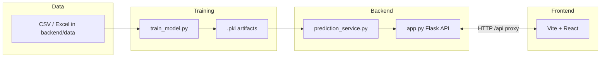

# Attendance Predictor — Project Documentation

This document explains the **architecture**, **backend API**, **machine learning pipeline**, **frontend**, **training**, and **operational** pieces so you can navigate and extend the system with confidence.

---

## 1. What this project does

The system **forecasts daily attendance** (a single numeric “headcount” or present-equivalent total per calendar day) using a **Random Forest regressor** trained on historical files (CSV / Excel). It exposes a **REST API** (Flask) and a **React dashboard** (Vite) for predictions, charts, and optional **email digests**.

**Important:** Training data may mix true “daily totals” with **rolled-up** or **synthetic** dates from some Excel layouts; the model learns whatever aggregate you feed it. See [§5.4 Data layouts](#54-data-layouts-the-trainer-understands).

---

## 2. High-level architecture



- **Training** is offline: you run `train_model.py`; it writes model + metadata to `backend/model/*.pkl`.
- **Inference** loads those pickles in **`prediction_service.py`** (shared by the API and the email job).
- **Browser** talks only to the Vite dev server; Vite **proxies** `/api/*` to Flask (`127.0.0.1:5000`).

---

## 3. Repository layout

| Path | Purpose |
|------|---------|
| `backend/app.py` | Flask app: routes, CORS, email settings, notification test endpoint |
| `backend/prediction_service.py` | Load `.pkl`, build feature rows, predict, weekend/Sunday rules, tree band |
| `backend/model/train_model.py` | End-to-end training script |
| `backend/model/*.pkl` | **Generated** — model, feature order, meta, historical series |
| `backend/data/` | **Your** attendance files (recursive scan); no sample data shipped by default |
| `backend/email_scheduler.py` | APScheduler + SMTP for daily forecast emails |
| `backend/email_settings.json` | Persisted UI/env overrides for SMTP (created at runtime) |
| `backend/notification_log.json` | Last notification times (truncated log) |
| `backend/.env` | Optional env vars (copy from docs / create locally) |
| `frontend/` | Vite + React + Tailwind UI |
| `train.bat` | Windows helper: `cd backend`, install deps, run training |

---

## 4. Backend (Flask)

### 4.1 Entry point

- **`python app.py`** (from `backend/`) starts Flask with **`debug=True`** on **`0.0.0.0`**.
- Port: **`FLASK_PORT`** env (default **5000**).

### 4.2 CORS

Browser requests from the Vite dev server are allowed for:

- `http://localhost:5173`–`5175` and `http://127.0.0.1:5173`–`5175`

If Vite picks another port, add it in `app.py` under `CORS(...)`.

### 4.3 API routes

| Method | Path | Description |
|--------|------|----------------|
| `GET` | `/api/predict?date=YYYY-MM-DD` | Single-day forecast + 10th–90th percentile band from RF trees |
| `GET` | `/api/predict-range?start=&end=` | Sequential days; each day feeds the next via extended series for lags |
| `GET` | `/api/historical` | Daily `date` + `attendance` for charts |
| `GET` | `/api/model-info` | `trained_at`, metrics, feature importances, `last_historical_date`, etc. |
| `GET` | `/api/best-days?start=&end=&top_n=&min_attendance=&event_type=&include_saturdays=` | Rank best dates for events using predictions + weekday history + calendar + confidence |
| `GET` | `/api/calendar/events` | Public: current academic calendar JSON |
| `POST` | `/api/calendar/upload` | Admin: upload calendar PDF (multipart `pdf`) → extract events (LLM) (no save) |
| `POST` | `/api/calendar/save` | Admin: save edited calendar JSON (creates `calendar_events.prev.json`) + hot-reload |
| `POST` | `/api/calendar/retrain` | Admin: retrain model with safety net (auto-revert if much worse) |
| `POST` | `/api/calendar/rollback` | Admin: restore previous model artifacts (+ restore previous calendar if present) |
| `GET` | `/api/settings/email` | Email settings (password omitted); `last_notification_at` |
| `POST` | `/api/settings/email` | Update SMTP / staff email / enable / send time |
| `POST` | `/api/send-notification` | Send test email for **tomorrow**’s forecast |

### 4.4 Environment variables (typical)

Loaded via **`python-dotenv`** from `backend/.env`:

| Variable | Role |
|----------|------|
| `STAFF_EMAIL` | Default recipient |
| `SMTP_HOST`, `SMTP_PORT` | Mail server |
| `SENDER_EMAIL`, `SENDER_PASSWORD` | SMTP auth |
| `NOTIFICATION_TIME` | Default daily send time (e.g. `18:00`) |
| `FLASK_PORT` | API port |
| `RUN_EMAIL_SCHEDULER` | If `1` / `true` / `yes`, embeds scheduler when running `app.py` |

### 4.5 Email settings merge order

1. Defaults from env (`_default_settings` in `app.py` / `email_scheduler.py`).
2. Overrides from **`email_settings.json`** (updated by the UI `POST`).

Password is never returned by `GET`; only `sender_password_set: true/false`.

---

## 5. Machine learning

### 5.1 Algorithm

- **Model:** `sklearn.ensemble.RandomForestRegressor` (200 trees, depth/split/leaf hyperparameters set in `train_model.py`).
- **Target:** `attendance` — one scalar per **calendar day** after aggregating all files (sum of per-file daily contributions, then one row per date).

### 5.2 Features (fixed order)

The vector passed to the forest is **exactly** this list (see `FEATURE_NAMES` in `train_model.py`):

| Feature | Meaning |
|---------|---------|
| `day_of_week` | 0=Monday … 6=Sunday |
| `day_of_month`, `month`, `week_of_year`, `quarter`, `day_of_year` | Calendar structure |
| `is_weekend` | 1 if Saturday or Sunday |
| `is_monday`, `is_friday` | Flags |
| `is_month_start`, `is_month_end` | Rough boundary flags |
| `lag_1`, `lag_7` | Previous day / 7 days ago attendance (from historical series; fallbacks if missing) |
| `rolling_mean_7`, `rolling_mean_30` | Rolling means of past attendance |
| `is_holiday`, `is_exam_day`, `is_break`, `is_fest_day` | Academic calendar flags |
| `days_to_nearest_holiday`, `days_after_holiday` | Holiday proximity signals (capped) |
| `days_to_next_exam` | Exam proximity signal (capped) |
| `is_sandwich_day`, `is_post_break_monday` | Calendar-pattern flags |

**Training:** last 20% of rows (time-ordered, `shuffle=False`) for hold-out metrics.

### 5.3 Training outputs (`backend/model/`)

| File | Contents |
|------|----------|
| `attendance_model.pkl` | Fitted `RandomForestRegressor` |
| `feature_columns.pkl` | List of feature names (order for inference) |
| `training_meta.pkl` | `trained_at`, `n_records`, `metrics` (MAE, RMSE, R², MAPE, MdAPE, wMAPE), `fallbacks`, `feature_importances`, `last_historical_date`, `attendance_summary` |
| `historical_daily.pkl` | DataFrame: `date`, `attendance` (used for lags and charts) |

If these are missing, `/api/predict` raises **“Model not trained”**.

### 5.4 Data layouts the trainer understands

All discovery is under **`backend/data/`** (recursive). Ignored: `__MACOSX`, `~$*` (Excel lock), `._*`.

1. **Long tables (CSV / Excel first sheet)**  
   - Detected **date** column (name heuristics + dtypes).  
   - **Present** count column, or **% + total**, or **% only** (sum of %/100 as present-equivalents per row).

2. **IIIT-style wide Excel (all sheets)**  
   - Month row + day row (including `29th`, `1st`, …) + student rows.  
   - **P/A** or **1/0** per session column → counts per resolved calendar day.  
   - Supports **Enrolment No** in column B, **Registration No** row, etc.

3. **Snapshot-only sheets**  
   - No daily grid: student **%** or **session counts** → **one synthetic date per sheet** (spread by file path hash) so mixed exports still contribute.

4. **Lecture + lab “Present” blocks**  
   - Registration header + two **Present** columns → sum both down the sheet.

After loading, all daily series are **concatenated**, **grouped by date** (sum), sorted, and missing attendance filled with the **median** for training stability.

### 5.5 How to train

From `backend/`:

```bash
pip install -r requirements.txt
python model/train_model.py
```

Or run `train.bat` from the repo root (Windows).

**After changing data**, retrain and **restart Flask** so `joblib.load` picks up new files.

---

## 6. Inference (`prediction_service.py`)

### 6.1 Loading

`load_artifacts()` returns `(model, feature_names, meta, historical)` or `None` if files missing.

### 6.2 Feature row for a target date

`build_feature_row(target, series, meta)`:

- Builds calendar features from `target`.
- Pulls `lag_1`, `lag_7`, rolling means from **`historical`** series (with **fallbacks** from `meta["fallbacks"]` when history is short).
- If predicting **beyond the last training date**, lags/rollings are adjusted to use the **tail** of the known series (documented in code).

### 6.3 Prediction and confidence band

- Each tree predicts one value; **mean** = point forecast.
- **10th / 90th percentile** across trees = **confidence_range** (not a Gaussian CI).

### 6.4 Calendar overrides (important)

`adjust_prediction_for_calendar(...)`:

- **Sunday:** predicted value and band are forced to **0** (no regular classes).
- **Saturday:** high model outputs are **damped** (capped), not forced to zero.

Same logic is used in **`/api/predict`** and **`/api/predict-range`**.

### 6.5 `historical_avg` in API response

Average of **historical attendance on the same weekday** as the target (for context in UI/email).

---

## 7. Frontend (React + Vite)

### 7.1 Stack

- **React 18**, **Vite 5**, **Tailwind CSS**
- **Framer Motion** — page/section motion
- **Recharts** — attendance chart
- **Sonner** — toasts (`theme="dark"`)

### 7.2 Dev server & API

- **`vite.config.js`**: `server.port` **5173**; **`proxy`** `/api` → `http://127.0.0.1:5000`.
- UI code uses **relative** URLs like `fetch("/api/...")` so the proxy works.

### 7.3 Main files

| File | Role |
|------|------|
| `src/main.jsx` | React root, global `Toaster` |
| `src/App.jsx` | Wraps `Dashboard` with motion |
| `src/index.css` | Tailwind + custom theme (`ui-panel`, smooth scroll, etc.) |
| `src/components/Dashboard.jsx` | Main page: hero, prediction card, chart, model footer, nav targets |
| `src/components/PredictionCard.jsx` | Date input + single-day prediction |
| `src/components/AttendanceChart.jsx` | Fetches `/api/historical` (+ range predict if used) |
| `src/components/NotificationSettings.jsx` | Email settings `GET`/`POST` |
| `src/components/FloatingNav.jsx` | In-page scroll navigation |
| `src/components/ScrollProgress.jsx`, `ScrollMotion.jsx`, … | UX polish |

### 7.4 Production build

```bash
cd frontend
npm install
npm run build
```

Static output in `frontend/dist/`. You still need a **separate** host for the API (or configure a reverse proxy); the dev proxy does not apply to `preview` unless you configure it.

---

## 8. Email scheduler

- **`email_scheduler.py`** can run **standalone** (`python email_scheduler.py`) or **inside** Flask if `RUN_EMAIL_SCHEDULER=1`.
- Uses **APScheduler** `BackgroundScheduler` to run **`run_daily_job`** at the configured **local** send time.
- Job checks **`enabled`** in settings; predicts **tomorrow** via `predict_for_date`; sends HTML email with forecast + rough **canteen / buses / rooms** heuristics.

---

## 9. Dependencies

**Backend** (`requirements.txt`): Flask, flask-cors, pandas, numpy, scikit-learn, joblib, openpyxl, apscheduler, python-dotenv.

**Frontend** (`package.json`): react, react-dom, vite, tailwind, framer-motion, recharts, sonner.

---

## 10. Common workflows

| Goal | Steps |
|------|--------|
| First-time setup | `cd backend && pip install -r requirements.txt` · `cd frontend && npm install` |
| Add data | Copy CSV/XLSX under `backend/data/` (subfolders OK) |
| Train | `cd backend && python model/train_model.py` |
| Run API | `cd backend && python app.py` |
| Run UI | `cd frontend && npm run dev` → open URL shown (5173 or next free port) |
| Test email | Configure settings, then `POST /api/send-notification` or enable scheduler |

---

## 11. Limitations & caveats
## 11.1 Best Days Finder

The dashboard includes a “Best Days Finder” that ranks dates in a range for hosting events.
This is **ranking-focused**: due to mixed-scale training data, absolute predicted counts have limited precision.

Scoring combines:

- Predicted attendance (normalized within range)
- Historical weekday strength (mean by day-of-week from `historical_daily.pkl`)
- Academic calendar proximity (holidays/exams)
- Confidence tightness (Random Forest per-tree spread)

Backend: `GET /api/best-days` implemented in `backend/recommendation_service.py`.

---

## 11.2 Calendar PDF Pipeline

Admins can upload an institute academic calendar PDF, extract events via an LLM, review/edit, and save:

- `POST /api/calendar/upload` (admin) → extracts structured events (does not write to disk)
- `POST /api/calendar/save` (admin) → writes `backend/calendar_events.json` and keeps a backup at `backend/calendar_events.prev.json`
- `GET /api/calendar/events` (public) → returns current saved calendar

Saved calendar data is cached for performance and can be reloaded immediately after save without server restart.

Backend: `backend/calendar_service.py`, `backend/calendar_features.py`
Frontend: `frontend/src/components/CalendarAdmin.jsx` (only shown when `?admin=1`)

---

## 11.3 Retraining Safety Net

After updating the calendar, admins can retrain the model:

- `POST /api/calendar/retrain` (admin)
  - Backs up all model artifacts to `*.prev.pkl`
  - Trains a new model with the current calendar features
  - Auto-reverts to previous artifacts if MdAPE degrades by >20%
  - Hot-reloads the model in the running API process

Manual rollback is always available:

- `POST /api/calendar/rollback` (admin)
  - Restores model artifacts from `*.prev.pkl`
  - Restores `calendar_events.prev.json` if present
  - Hot-reloads both calendar and model caches

Backend: `backend/retrain_service.py`, `backend/model/train_model.py`


1. **Scale mixing:** Daily grids, snapshot rollups, and multi-class sums can produce **very different scales** on the same timeline; metrics (e.g. mean MAPE) can look extreme — training prints **MdAPE** and **wMAPE** partly for that reason.
2. **Sunday data in history:** If your training data accidentally contains **non-zero Sundays**, the model may still have learned patterns; inference **overrides Sunday to 0** anyway.
3. **No authentication** on the API by default — do not expose `0.0.0.0:5000` to the public internet without a reverse proxy and auth.
4. **Debug Flask** is not suitable for production; use a WSGI server (gunicorn, waitress, etc.) for deployment.

---

## 12. Quick reference — files to read when you change…

| Change | Primary files |
|--------|----------------|
| API shape / new route | `backend/app.py` |
| Model inputs / Sunday rules | `backend/prediction_service.py` |
| Training / data parsing | `backend/model/train_model.py` |
| Calendar extraction/admin | `backend/calendar_service.py`, `backend/calendar_features.py`, `frontend/src/components/CalendarAdmin.jsx` |
| Retraining safety net | `backend/retrain_service.py`, `backend/model/train_model.py` |
| Best-days ranking | `backend/recommendation_service.py`, `frontend/src/components/BestDaysFinder.jsx` |
| UI copy / layout | `frontend/src/components/Dashboard.jsx` and children |
| API base URL in dev | `frontend/vite.config.js` |
| CORS origins | `backend/app.py` |

---

*Last aligned with the codebase structure and behavior as of the documentation generation date; if you refactor, grep for the symbols above to confirm.*
